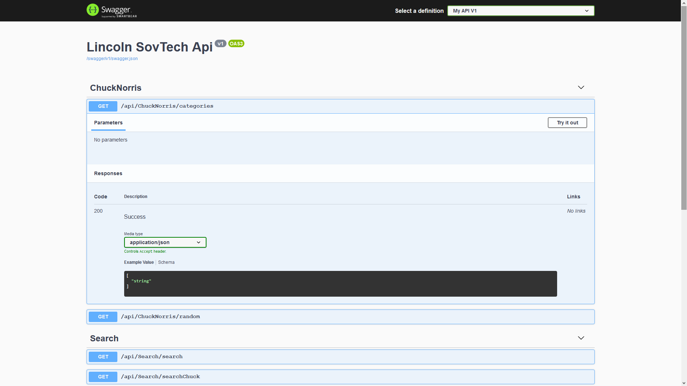

# LincolnSovTechBackend

Implementation of an OpenAPI compliant web service that abstracts away two downstream APIs; the Chuck Norris API and the Star Wars API.

You can find the hosted version [Here on my Heroku Instance](https://lincolnsovtech.herokuapp.com/index.html)

# Usage

    Git Clone (https://github.com/Lwachira/LincolnSovTechBackend.git)
    CD to the location
    dotnet restore
    dotnet run
    Fingers Crossed (Use the Heroku Instace instead)